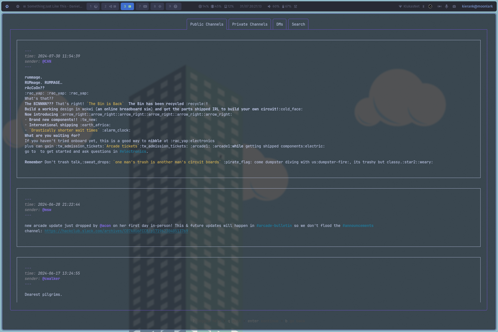

# Charming Slack

An effort to charm slack into submission to the great ssh gardeners.

## Setup

You need these variables available
```bash
SLACK_CLIENT_ID="xxxxx.xxxxxx"
SLACK_CLIENT_SECRET="xxxxxxxxxxxxxxxxx"
```
You also need a slack app
```yaml
display_information:
  name: Charming Slack
  description: Your very own ssh agent dismissed to the dark relms of the wood forever condemed to serve the users of hackclub
  background_color: "#32283d"
  long_description: Found near the Whispering Wood, a weathered slab lies etched with cryptic lore. It speaks of Klavis, the Banished Keymaster. Once a celestial gatekeeper, he tasted forbidden bubble tea, a concoction rumored to grant wishes beyond the Cloud's control. Now condemned, Klavis dwells within the wild, his power twisted. Legends whisper of "Charming Slack," a fantastical bridge born from his exile, serving a new purpose - a wish granted, a gateway for aspiring programmers, forever veiled in the sweet, whimsical magic of the Wood.
oauth_config:
  redirect_urls:
    - http://localhost:23233/slack/install
  scopes:
    user:
      - channels:history
      - channels:read
      - channels:write
      - chat:write
      - groups:history
      - groups:read
      - groups:write
      - identify
      - im:history
      - im:read
      - im:write
      - links:read
      - links:write
      - mpim:history
      - mpim:read
      - mpim:write
      - users:read
      - users.profile:read
settings:
  org_deploy_enabled: false
  socket_mode_enabled: false
  token_rotation_enabled: false
```


